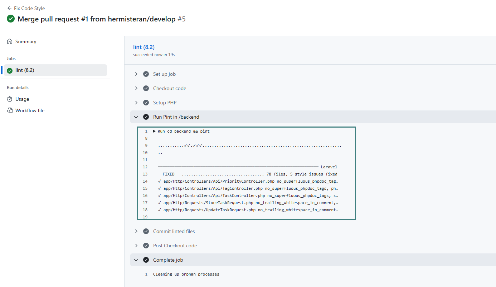
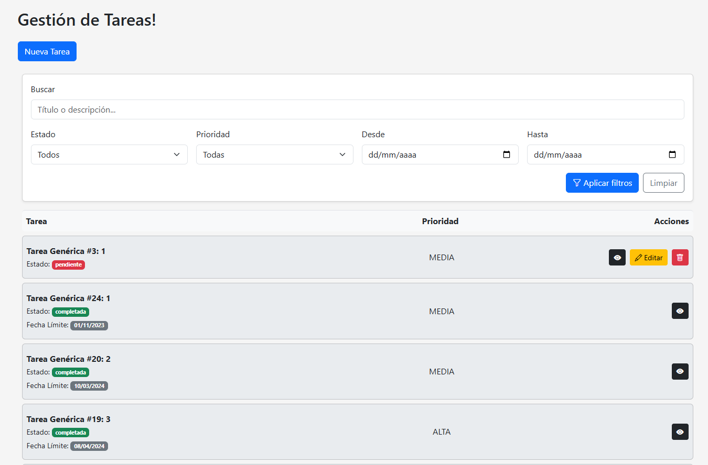
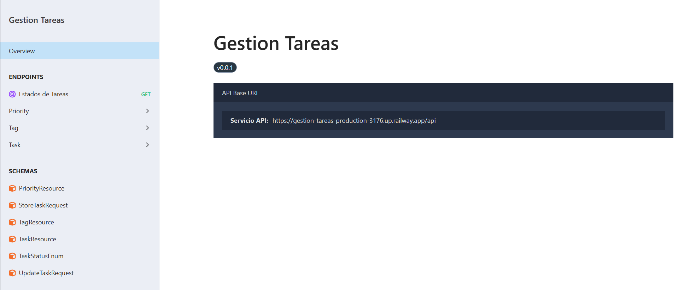

#  Challenge Técnico — Gestión de Tareas

##  Descripción del Proyecto
Este proyecto es una aplicación **Fullstack** desarrollada como parte del desafío técnico “Gestión de Tareas”.  
Permite crear, listar, editar, eliminar y filtrar tareas, asignándoles prioridades y etiquetas.  


---

## Proyecto desplegado
> Puede tardar en cargar unos minutos al principio.

| Parte | URL |
|------|------|
| **Backend - API** | [https://gestion-tareas-production-3176.up.railway.app/docs/api/](https://gestion-tareas-production-3176.up.railway.app/docs/api/) |
| **Frontend** | [https://tareas-front-production.up.railway.app/](https://tareas-front-production.up.railway.app/) |


---

##  Arquitectura General

El proyecto está compuesto por tres servicios principales, orquestados mediante **Docker Compose**:

| Servicio | Tecnología | Descripción |
|-----------|-------------|-------------|
| **Backend** | PHP 8.1 + Laravel 10 + Apache | API RESTful con recursos, validaciones, enums, tests e integración con Scramble |
| **Frontend** | Vue 3 + Vite + Pinia + Bootstrap 5 | SPA responsiva para gestionar las tareas y consumir la API |
| **Base de datos** | MySQL 8 | Almacenamiento de tareas, prioridades y etiquetas |

---

## Tecnologías Utilizadas

### Backend
- **PHP 8.1**
- **Laravel 10**
- **Composer 2**
- **MySQL 8**
- **Apache 2**
- **Scramble** para documentación interactiva de la API
- **Laravel Pint** para estandarización de código
- **PHPUnit** para pruebas automatizadas

### Frontend
- **Vue.js 3**
- **Vite**
- **Pinia** (store global)
- **Axios** (consumo de API)
- **Bootstrap 5** (diseño responsive y componentes UI)
- **Bootstrap Icons**
- **Nginx** (para build de producción)

---

## Estructura del Proyecto

```
project-root/
│
├── backend/              # API Laravel 10
│   ├── app/
│   ├── database/
│   ├── routes/
│   ├── tests/
│   ├── Dockerfile
│   ├── Dockerfile.dev
│   └── .dockerignore
│
├── frontend/             # Vue 3 + Vite
│   ├── src/
│   ├── public/
│   ├── Dockerfile
│   ├── Dockerfile.dev
│   └── .dockerignore
│
├── docker-compose.dev.yml
├── docker-compose.yml
└── README.md
```

---

## Entorno Docker

El entorno se divide en dos modos:

### Desarrollo (Hot Reload)
```bash
docker compose -f docker-compose.dev.yml up --build
```
- Backend con **Apache + Laravel** montado por volumen.
- Frontend con **Vite** y recarga automática (HMR).
- Base de datos MySQL persistente.

### Producción (Optimizado)
```bash
docker compose up -d --build
```
- Backend con dependencias preinstaladas.
- Frontend compilado y servido por **Nginx**.
- Configuración lista para despliegue.

---

## Documentación de la API (Scramble)

El proyecto utiliza **Scramble** para documentar automáticamente los endpoints REST.

Una vez en ejecución, la documentación puede consultarse en:
```
http://localhost:8000/docs
```

### Endpoints principales:
- `GET /api/tasks` — Listar tareas
- `POST /api/tasks` — Crear nueva tarea
- `GET /api/tasks/{id}` — Ver tarea
- `PUT /api/tasks/{id}` — Actualizar tarea
- `DELETE /api/tasks/{id}` — Eliminar tarea
- `GET /api/statuses` — Obtener estados válidos
- `GET /api/priorities` — Listar prioridades
- `GET /api/tags` — Listar etiquetas

---

## Tests automatizados

Los **tests de integración y unitarios** fueron implementados con **PHPUnit** y se ejecutan automáticamente en **GitHub Actions**.

Comando para ejecutar desde Docker

```bash
docker exec -it laravel_dev bash
php artisan test --filter=TaskFeatureTest
```

*Ejecución de tests desde GitHub Actions*  


---

##  Formato de código — Laravel Pint

El proyecto usa **Laravel Pint** para mantener un estilo uniforme de código.

Comando para ejecutar desde Docker

```bash
vendor/bin/pint
```

 *Ejecución automática en GitHub Actions*  


---

##  Validaciones y Principios SOLID

- Se aplicaron **Form Requests** para validar creación y edición de tareas.  
- Se empleó una arquitectura basada en **Servicios**, separando lógica de negocio y acceso a datos.  
- Se respetaron los principios **SOLID**, especialmente el de **Responsabilidad Única (SRP)**.

---

## Bonus Implementados

✅ Filtros dinámicos por estado, prioridad y rango de fechas.  
✅ Componente de paginación con Bootstrap.  
✅ TaskForm en modal responsive con checkboxes.  
✅ Docker en dos entornos (dev/prod).  
✅ Documentación automática con Scramble.  
✅ GitHub Actions con Tests + Pint.  
✅ Código estructurado, mantenible y escalable.

---

## Ejecución local (sin Docker)

**Backend**
```bash
cd backend
composer install
cp .env.example .env
```
**Variables de Entorno:**
Antes de ejecutar los comandos, asegúrate de **definir el valor** de las siguientes variables en el archivo **`.env`** del backend:

```bash
APP_URL=http://localhost
DB_CONNECTION=mysql
DB_HOST=127.0.0.1
DB_PORT=port # Reemplaza 'port' con tu puerto de DB
DB_DATABASE=laravel # Reemplaza 'laravel' con el nombre de tu base de datos
DB_USERNAME=root # Reemplaza 'root' con tu usuario de DB
DB_PASSWORD=**** # Reemplaza '****' con tu contraseña de DB

```
Comandos:
```bash
php artisan key:generate
php artisan migrate --seed
php artisan serve
```

**Frontend**
```bash
cd frontend
cp .env.example .env
```

**Variables de Entorno:**
Antes de ejecutar los comandos, asegúrate de **definir el valor** de las siguiente variable en el archivo **`.env`** del frontend:

**Frontend**
```bash
npm install
npm run dev
```
## Captures
### Frontend

## Documentación de la API



